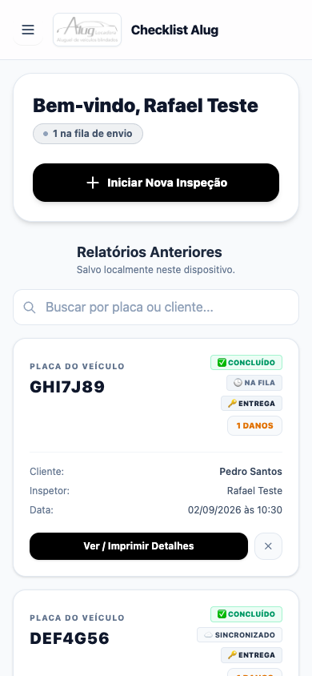
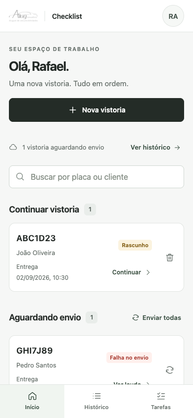

# Checklist UI refresh

The interface now prioritizes starting and resuming vehicle inspections on a phone. Shared navigation exposes Início, Histórico, and Tarefas; the inspection flow replaces navigation with persistent Back/Continue controls and Save and exit.

The light visual system uses system fonts, consistent line icons, compact records, and readable form controls. History provides separate cloud and device views, and local/cloud reports share their presentation and print layout. Task attachments and damage editors use native dialogs with focus restoration and mobile sheets.

Inspection saves are serialized. Step links and Continue apply the same validation, corrected fields clear their errors, failed saves stay actionable, and completion cannot be overwritten by an older draft. Photo selection enforces the existing six-per-part and 24-per-inspection limits. Updates are deferred while an inspection is open.

## Screenshots

All records shown are synthetic test data. The original screen was captured from the branch's base revision in a separate temporary checkout.

| Original home | Redesigned home |
| --- | --- |
|  |  |

[Desktop home](ui-refresh/home-desktop.png) · [Inspection on a phone](ui-refresh/inspection-mobile.png) · [Task details](ui-refresh/task-details-mobile.png)

## Verification

- `npm test`: unit tests, Svelte diagnostics, and production build.
- `npm run test:ui`: browser smoke tests against an already running Vite server. Requires a local Chrome executable and uses the existing `puppeteer-core` dependency.
- Defaults: `UI_BASE_URL=http://127.0.0.1:5173`, `CHROME_PATH=/Applications/Google Chrome.app/Contents/MacOS/Google Chrome`, `UI_OUTPUT_DIR=/private/tmp/checklist-ui-verification`. Override these environment variables when needed.
- Browser tests cover 360px/390px/1440px home layouts; consistent step validation and focus; save failure and retry; damage photo/CNH uploads and signatures; local offline completion and reconnection sync; history search and pagination; draft resume; local/cloud reports and photo deletion; printable PDF output; task attachments and nested dialog dismissal.
- Tests use real IndexedDB, compression, serialization, and sync orchestration, with synthetic authentication, Firestore, storage, and HTTP responses. External requests are blocked. Service workers are bypassed for deterministic mocks; installed-PWA caching and native phone camera/keyboard behavior still require device testing.

## Compatibility

Routes, Firebase endpoints, permissions, storage paths, IndexedDB version, and cloud payload schemas are preserved. No Firebase or environment configuration changes or new production dependencies are required. All interface text remains Portuguese.
